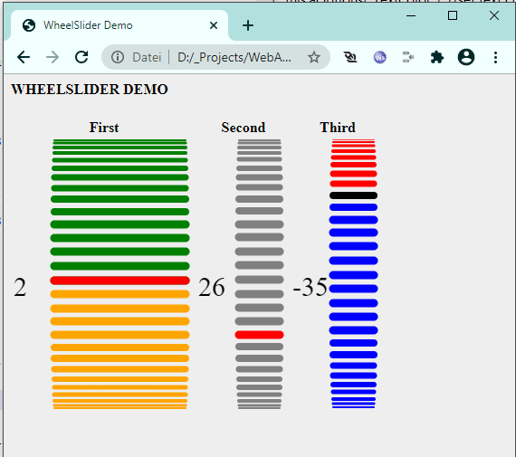

# Wheelslider Javascript

## Introduction
This javascript module displays and handle a sliderwheel.

## Wheelslider API
To use the wheelslider control you have to create a global variable of
the class WheelSlider. For example:<br/>
`var Wheel1 = new WheelSlider();`

Now, let's look into the wheelslider class to see it's member functions:

### init( sCanvasId )
This function initialize the internal variables and draws the wheelslider.<br/>
NOTE: The canvas must exists. To ensure this, call this function after the onload event of your website.<br/>
<i>sCanvasId</i> is the ID of the canvas element<br/>
For example:<br/>
`Wheel1.init( "canvas1" );`

### setOption( sOption, sValue )
This function sets an option parameter.<br/>
<i>sOption</i> is the name of the option to change<br/>
<i>sValue</i> is the new value of the option

<b>Available options (sOption)</b>
* "TickColor1" : color of the ticks above the active tick - default: "green"
* "TickColor2" : color of the active tick - default: "red"
* "TickColor3" : color of the ticks below the active tick - default: "orange"
* "TickAngle" : angle in degree between the ticks - default: 6
* "TextFont" : font and size of the value text - default: "30px bold Robot"
* "TextColor" : color of the value text - default: "black"

### redraw()
This function forces a redraw of the wheelslider. 
It is recommended to call this after you have changed 
one or more options. For example:<br/>
`Wheel1.redraw();`

### handleResize()
This function should be called, if the size of the window
where the wheelslider resides changes. For example:<br/>
`window.onscroll = function(){ Wheel1.handleResize(); ... }`

### handleMouseMove()
Call this function, if the mouse moves inside the sliderwheel canvas area.
For example:<br/>
`Wheel1.canvas.onmousemove = function(e){ Wheel1.handleMouseMove(e); ... };`

### handleTouchMove()
Call this function, if a touch event was detected inside the sliderwheel canvas area.
This is very important for devices with touch display, like mobile phones, tablets etc.
For example:<br/>
`Wheel1.canvas.ontouchmove = function(e){ Wheel1.handleTouchMove(e); ... };`

## How to include in your project
To include the sliderwheel into your html project, add 
this following line in your code:
`<script src="wheelslider.js"></script>`

The following example html page shows you, how to include and handle the wheelslider: 
```
<html>
<head>
<meta charset='utf-8'>
<title>WheelSlider Demo</title>
<meta name='viewport' content='width=device-width, initial-scale=1'>
<script src="wheelslider.js"></script>
<script>
//
var Wheel1 = new WheelSlider();
var Wheel2 = new WheelSlider();
var Wheel3 = new WheelSlider();
//
function onInit()
{
   Wheel1.init( "canvas1" );
   Wheel1.canvas.ontouchmove = function(e){ Wheel1.handleTouchMove(e); };
   Wheel1.canvas.onmousemove = function(e){ Wheel1.handleMouseMove(e); };
   Wheel2.init( "canvas2" );
   Wheel2.canvas.ontouchmove = function(e){ Wheel2.handleTouchMove(e); };
   Wheel2.canvas.onmousemove = function(e){ Wheel2.handleMouseMove(e); };
   Wheel2.setOption( "TickColor1", "gray" );
   Wheel2.setOption( "TickColor3", "gray" );
   Wheel2.redraw();  //displays the changed colors
   Wheel3.init( "canvas3" );
   Wheel3.canvas.ontouchmove = function(e){ Wheel3.handleTouchMove(e); };
   Wheel3.canvas.onmousemove = function(e){ Wheel3.handleMouseMove(e); };
   Wheel3.setOption( "TickColor1", "red" );
   Wheel3.setOption( "TickColor2", "black" );
   Wheel3.setOption( "TickColor3", "blue" );
   Wheel3.redraw();  //displays the changed colors
   //
   window.onscroll = function(){ Wheel1.handleResize(); Wheel2.handleResize(); Wheel3.handleResize(); }
   window.onresize = function(){ Wheel1.handleResize(); Wheel2.handleResize(); Wheel3.handleResize();}
}

</script>
<style>
   body{ background-color: #eeeeee; }
</style>
</head>

<body onload="onInit('canvas');">
   <h4>WHEELSLIDER DEMO</h4>
   <table>
      <tr><th>First</th><th>Second</th><th>Third</th></tr>
      <tr>
         <td><canvas id="canvas1" width=200 height=300></canvas></td>
         <td><canvas id="canvas2" width=100 height=300></canvas></td>
         <td><canvas id="canvas3" width=100 height=300></canvas></td>
      </tr>
   </table>
</body>
</html>
```
And this is how it looks like - please see the file 'readme.png'

